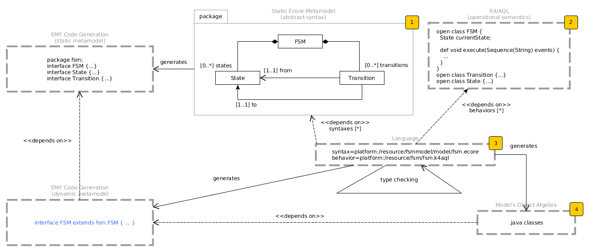

# Plan

## Context

The multiplication of DSL requires a proper support to reuse (in both syntactic and semantically dimensions) in an open world: without touching something that didn't anticipate the reuse.

## Problem

current solutions rely on the time-honored visitor pattern which require anticipation to support incremental compilation

## Solution

We provide an implementation leveraging practices in the functional world to express the behavior, bound to an object structure + specific type group checker.

## Expected result

- easiest development of languages/less build time overall
- correct execution time

## Conclusion

The pattern support incremental reuse and extensibility in both dimensions, without performance overhead wrt. to non-extensible approach, and thus saving the performance issue of the current solution for extensibility (e.g. Melange)
