

# Java Virtual Machine performance

## Data

### Virtual Machines

### GraalVM EE

Java 8

### GraalVM CE

Java 8

### OpenJ9

Java 8, 11, 12

### OpenJDK

Java 8, 11, 12

### Languages and Programs

## Setup

## Results

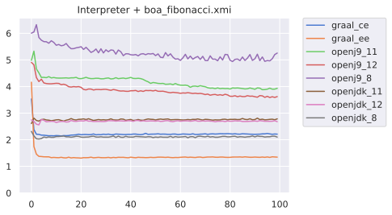
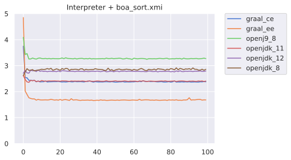
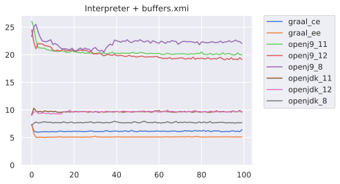
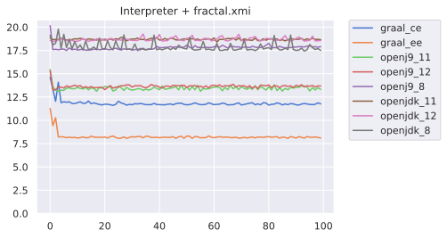
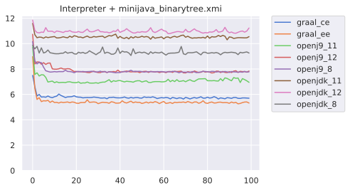
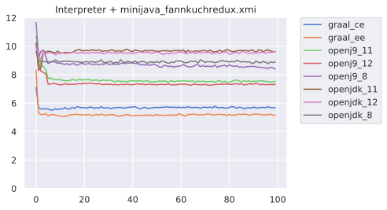
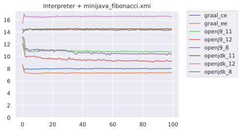
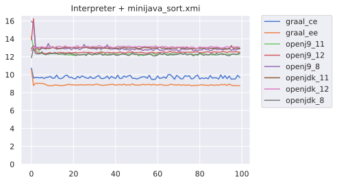
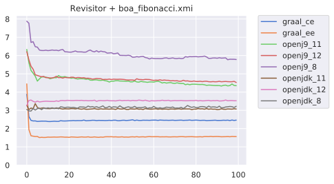
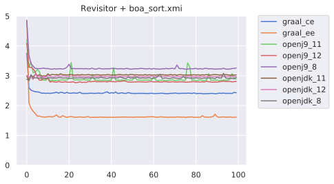
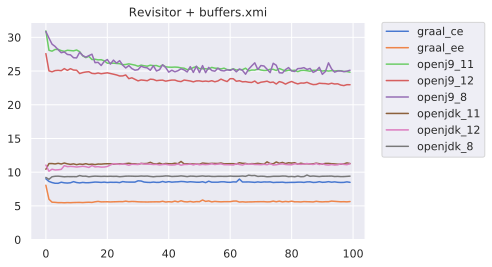
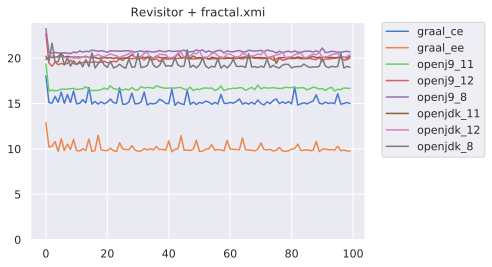
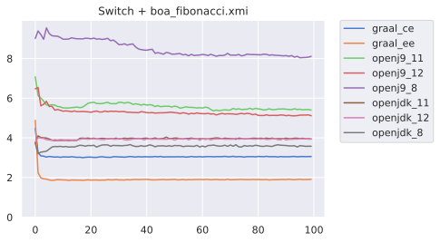
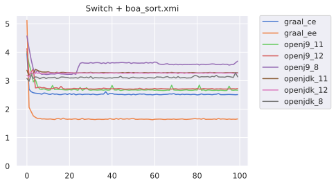
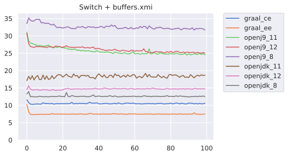
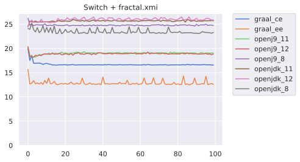
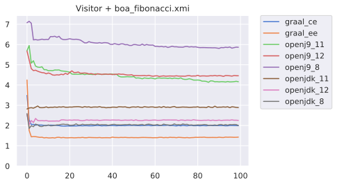
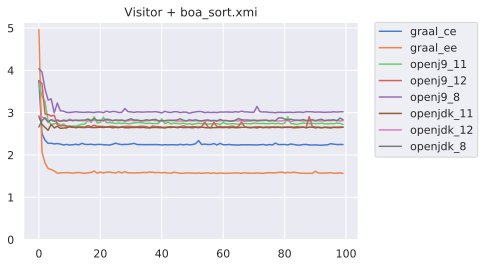
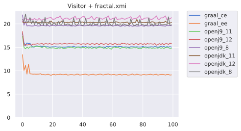

## Trends and Discussions

## Conclusion

