<style type="text/css">
img {
    width: 90%;
}
</style>


# Java Virtual Machine performance

In the last few years we went from a really limited choice of mainstream JVMs ([Oracle's JVM](https://www.oracle.com/technetwork/java/index.html) and [Openjdk](https://openjdk.java.net/)), to four wildly distributed JVM, with the introduction of [OpenJ9](https://www.eclipse.org/openj9/), recently open-sourced under Eclipse's banner and [GraalVM](https://www.graalvm.org/), by Oracle Lab.

And with such diversity arrive the question of the criteria on which to base our JVM choice.

In front of the limitless combination of criteria to base our choice on, we will focus on the execution time of programs executed using Domain-Specific Languages (DSLs) developed in Java.

We are going to identify the force and weakness of multiple JVM by measuring the execution time of multiple programs implemented on various DSLs (described below).
Then, we first compare their performance in term of pure execution time, and in term of stability (does the performance of a single program vary between two executions?).
Finally, we question the influence of the languages implementation patterns on DSLs performance.

## Data

In this first part, we describe the languages and programs used in our benchmarks.

### Languages and Programs

DSLs implementation can be separated into two broad categories: *Internal* and *External*.
The distinction is nicely described by [Martin Fowler](https://martinfowler.com/books/dsl.html) and can be summarized as follow:
an *Internal* DSL relies on the syntax of the host language and can also be seen as a language's library build in a way that fake a programming language.
Internal DSLs are also often called [Fluent API](https://en.wikipedia.org/wiki/Fluent_interface).
In comparison, *External* DSLs are based on their own syntax and semantics. 
Even if External DSL does not rely on a host language syntax, they still need to be implemented using an existing language (for instance the official Python implementation, CPython, is implemented in C).
While the implementation of External DSL can be more cumbersome at first, doing so allow more flexibility when fine customization of the language is needed.

In this article we focus on External DSL implemented in Java: **MiniJava**, **Boa**, **FSM** and **Logo**.

**MiniJava** a teaching-oriented subset of Java[^minijava].
**Boa** is a functional language inspired by OCaml[^boa].
**FSM** is allows the definition of systems of finite-state machines[^fsm].
Finally, **Logo**  is an procedural and education language, where one define the behaviour of a Tortoise[^logo].


MiniJava is used to implement the Fibonacci algorithm (**minijava_fibonacci**), a bubble sort algorithm (**minijava_sort**), a **binarytree** manipulation algorithm, and the **fannkuchredux** algorithm.
Boa is used to implement a Fibonacci algorithm (**boa_fibonacci**) and an insert sort algorithm (**boa_sort**).
The FSM language is used to define a set of four communicating state machines, sending messages to each other (**buffer**).
Finally, the Logo language is used to define a program that draws a Koch snowflake fractal (**fractal**).

By measuring the performance of the selection of languages and programs, our goal is to cover a large set of cases and usages: two general-purpose programming languages with different paradigms, a modeling language, and an "end-user" language.
For the languages with paradigms allowing various sort of implementation, we propose programs covering different styles from arithmetic intensive programs to structure  intensive programs, and from recursive style to iterative style.


### Virtual Machines

#### OpenJDK

OpenJDK is a free and open-source implementation of the Java platform.
It's JVM is called **HotSpot**.
OpenJDK is the reference JVM implementation since version 7.

We evaluate the three latest release of OpenJDK: 8, 11, 12 (called respectively **openjdk_8**, **openjdk_11**, and **openjdk_12** below).

#### OpenJ9

OpenJ9 is built on top of OpenJDK and targets cloud-based application though lower memory footing and faster startup times while keeping comparable execution time.

We evaluate the three latest release of OpenJ9: 8, 11, 12 (called respectively **openj9_8**, **openj9_11**, and **openj9_12** below).

#### GraalVM

GraalVM is a new JVM build on top of OpenJDK (Java 8u202) provided by Oracle Lab and targets performance and interoperability of languages on the JVM.

It allows to execution and collaboration of Java, R, Python, Javascript (Node), etc., in a single virtual machine.

GraalVM is distributed in two editions, Community Edition (CE) and Enterprise Edition (EE) (called respectively **graal_ce** and **grall_ee** below).
While GraalVM EE has the benefit of being open source, GraalVM EE is a non-free software that benefits from complementary performance improvements that are interesting to evaluate.

GraalVM supports solely Java 8.


## Setup

The evaluated JVM are downloaded from [https://adoptopenjdk.net/](https://adoptopenjdk.net/) and [https://www.graalvm.org/](https://www.graalvm.org/).

The measurements are done on an Ubuntu Server 18.04.1 LTS, with 14Go of RAM and an AMD A10-7700K CPU (Quad Core - 3.8GHz).

The benchmarks are executed using [JMH](https://openjdk.java.net/projects/code-tools/jmh/), an OpenJDK project dedicated to the definition and measurement of benchmarks on the JVM.

The class below is an example of our benchmark classes definition using JMH.
The `program` field is re-initialized in-between measurement, before each iteration using the `loadXMI` method.


```java
@State(Scope.Benchmark)
public class BoaVisitorBenchmark {
    @Param({"programs/boa_fibonacci.xmi", "programs/boa_sort.xmi"})
    public String program;
    private File program;

    @Setup(Level.Iteration)
    public void loadXMI() {
        // program loading ...
        this.program = (File) resource.getContents().get(0);
    }

    @Benchmark
    @BenchmarkMode(Mode.SingleShotTime)
    public void boaInterpreter() {
        // program execution ...
        program.eval();
    }
}
```

The benchmark is executed by measurement of the execution time of the `@Benchmark` annotated `boaInterpreter` method through a JMH specific command line.
For instance, the bash command below calls the boa language benchmark without warmup and proceed to 100 measurements, on the OpenJDK virtual machine.
This is the configuration used for the measurements presented below.

```bash
$ java -jar boa-benchmark/target/benchmarks.jar -wi 0 -i 100 -rf json \
    -rff boa_openjdk_12.json \
    -jvm benchmark_jvm/openjdk_12/bin/java
```

The json files produced are then processed with the help of the [pandas](https://pandas.pydata.org/) and [seaborn](https://seaborn.pydata.org/) libraries to produce the graphs below.


## Results

All graphs below are the result of the measurement of the implementation of the studied DSLs using the [Interpreter](https://sourcemaking.com/design_patterns/interpreter) implementation pattern (more details on implementation patterns in the [Further Discussion](#futher-discussion-implementation-patterns) section).

Each graph presents the evolution of the execution time on 100 iterations, on a single program, for the 8 different JVMs.

[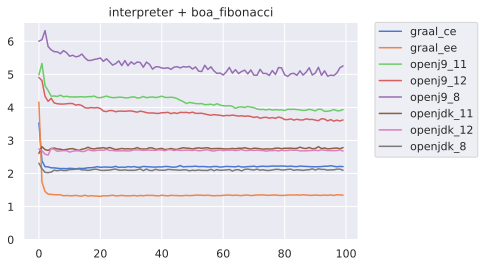](vm-perfs-figures/no_warmupinterpreter + boa_fibonacci_r.png)
[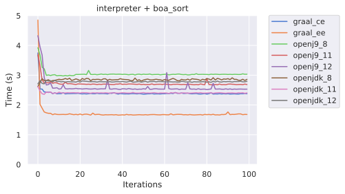](vm-perfs-figures/no_warmupinterpreter + boa_sort_r.png)
[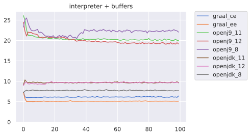](vm-perfs-figures/no_warmupinterpreter + buffers_r.png)
[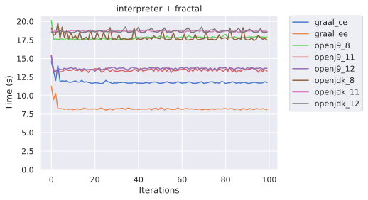](vm-perfs-figures/no_warmupinterpreter + fractal_r.png)
[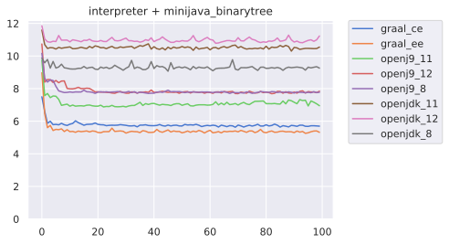](vm-perfs-figures/no_warmupinterpreter + minijava_binarytree_r.png)
[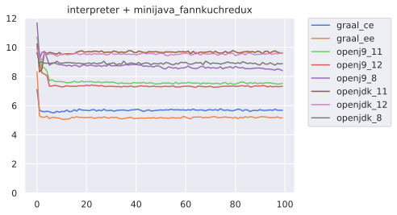](vm-perfs-figures/no_warmupinterpreter + minijava_fannkuchredux_r.png)
[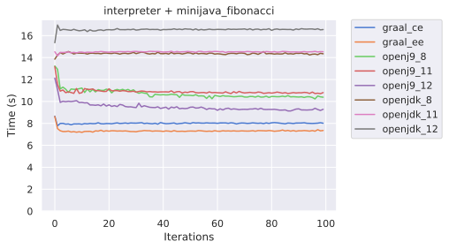](vm-perfs-figures/no_warmupinterpreter + minijava_fibonacci_r.png)
[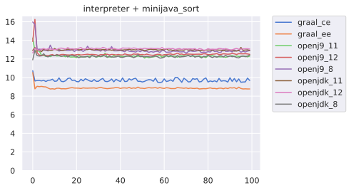](vm-perfs-figures/no_warmupinterpreter + minijava_sort_r.png)

## Trends and Discussions


All the conclusions below are to be taken in the context of our experiment and cannot be expanded to a broader context.

1. We can first observe a broad performance ordering of the JVM `graal_ee > graal_ce > openj9_{11,12} > openjdk_*/openj9_8`, even if some exceptions can be noticed, for instance the `interpreter + buffer` case is possibly hitting an OpenJ9 11 and 12 weakness, which make them measurably slower than OpenJDK and OpenJ9 8.
In contrast, we can observe that GraalVM EE is always the fastest, followed by GraalVM CE.
2. We can also observe that OpenJ9 11 and 12 are always faster that OpenJ9 8.
Comparatively, this is not the case of OpenJDK 11 and 12, which are often slower than OpenJDK 8.
This is an important fact to take into account in case of JVM version migration.
3. While most of the time the JVM are stable (and shows mostly flat curves), we can observe some instability from OpenJDK 8 and OpenJ9 8 on some scenarios.

<!-- TODO **Limitations:** we are here focusing on long-running and language based programs, which are not the main use-case targeted by JVM maintainers -->


## Futher discussion: Implementation patterns

As much as the underlying runtime platform has a strong influence on the runtime performance of programs, the way programs are implemented is also to be considered.
In the context of our four languages, we tried to identify the performance cost of four implementation patterns: **Interpreter**, **Visitor**, EMF's **Switch** and **Revisitor**.

Each implementation pattern is presented below with a summary of its main properties.
A snippet it proposed with each pattern presentation.
While their understanding is not required, they are provided for the interested reader.

### Interpreter

The [Interpreter pattern](https://sourcemaking.com/design_patterns/interpreter) is the most direct style of language implementation pattern, where the operations are directly embedded in the classes.

This makes the Interpreter pattern efficient at runtime because the only overhead is due to method calls.

The drawback comes when looking at other non-functional properties such as extensibility.
Adding new operations to an existing language, for instance, adding a pretty-print operation to an executable language, requires to intrusively modify each class of the language to add new operations.
Consequently, extending an Interpreter based language is intrusive and requires access to the Java sources

Oppositely, adding new concepts to a language, for instance, adding a multiply operation to an expression language is modular.

```java
abstract class Expr {
    abstract int eval();
    abstract String print();
}

class Sum extends Expr {
    Expr lhs, rhs;
    @Override int eval() {
        return lhs.eval() + rhs.eval();
    }
    @Override String print() {
        return "(" + lhs.print() + " + " + rhs.print() + ")";
    }
}

class IntLit extends Expr {
    int value;
    @Override int eval() {
        return value;
    }
    @Override String print() {
        return String.valueOf(value);
    }
}
```

### Visitor

The [Visitor pattern](https://sourcemaking.com/design_patterns/visitor) is one of the most commonly used language implementation patterns.

The Visitor is based on a simple principle, the operations of the language are not directly embedded in the language classes, but externalized in a Visitor class, which defines a behavior for the language, through the definition of one method by concepts of the language.

Compared to the Interpreter pattern, adding new operations to an existing language is modular.
Oppositely, adding new concepts to a language isn't modular, since each Visitor needs to be updated new methods.

Performance-wise, the Visitor suffers from *double-dispatch* cost, since each call between language concepts involves a polymorphic call to the `accept` method, followed by a call to a visitor's `visitXXX` method.

```java
interface Visitor<T> {
    T visitSum(Sum it);
    T visitIntLit(IntLit it);
}
interface Accept {
    <T> T accept(Visitor<T> visitor);
}
abstract class Expr implements Accept {}
class Sum extends Expr {
    Expr lhs, rhs;
    @Override <T> T accept(Visitor<T> visitor) {
        return visitor.visitSum(this);
    }
}
class IntLit extends Expr {
    int value;
    @Override <T> T accept(Visitor<T> visitor) {
        return visitor.visitIntLit(this);
    }
}
class EvalVisitor implements Visitor<Integer> {
    @Override Integer visitSum(Sum it) {
        return it.lhs.accept(this) + it.rhs.accept(this);
    }

    @Override Integer visitIntLit(IntLit it) {
        return it.value;
    }
}
class PrintVisitor implements Visitor<String> {
    @Override String visitSum(Sum it) {
        return "(" + it.lhs.accept(this) + " + " + it.rhs.accept(this) + ")";
    }

    @Override String visitIntLit(IntLit it) {
        return String.valueOf(it.value);
    }
}
```

### EMF's Switch

The EMF's Switch, or *Switch*, is popularized by the [Eclipse Modeling Framework](https://www.eclipse.org/modeling/emf/) (EMF) and is conceptually similar to the Visitor and shares the same non-functional properties.
The main difference is the absence of the accept method, replaced by a runtime type inspection (RTTY) and down-cast of the language concepts during the operations call using the `doSwitch` method of the Switch class.

Another interesting property of the Switch compared to the Visitor is the absence of accept methods, which allows the use of this pattern even if it has not been anticipated, in other words, one can reuse arbitrary groups of classes and interpret them without having to introduce an accept in each one of them.

We will see below that the substitution of java polymorphism mechanism for an RTTY often leads to slower interpreters.

```java
interface ExprSwitch<T> {
    T sum(Sum it);
    T intLit(IntLit it);
    default T fallback(Object it) { 
        throw new RuntimeException("Unknown " + it);
    }

    default T doSwitch(Object o) {
        if (o instanceof Sum) return sum((Sum) o);
        if (o instanceof IntLit) return intLit((IntLit) o);
        return fallback(o);
    }
}
abstract class Expr {}
class IntLit extends Expr {
    int value;
}
class Sum extends Expr {
    Expr lhs, rhs;
}
class EvalSwitch implements ExprSwitch<Integer> {
    @Override Integer sum(Sum it) {
        return doSwitch(it.lhs) + doSwitch(it.rhs);
    }

    @Override Integer intLit(IntLit it) {
        return it.value;
    }
}
class PrintSwitch implements ExprSwitch<String> {
    @Override String sum(Sum it) {
        return "(" + doSwitch(it.lhs) + " + " + doSwitch(it.rhs) + ")";
    }

    @Override String intLit(IntLit it) {
        return String.valueOf(it.value);
    }
}
```

### Revisitor

The revisitor is an implementation pattern we developed recently, with the objective to aggregate the positive properties of the three other implementation patterns while preserving runtime performance.

In summary, the revisitor pattern is:
- non-intrusive of the language concept classes,
- modular when introducing new language concepts and new language operations.

The shape of the Revisitor pattern is close to the Switch but introduce one generic type per language concepts.
Similarly, a dispatch (`$` methods) is defined by subtree of the language concepts classes hierarchy, which diminished the number of concepts to be tested by RTTY.

```java
 interface ExprRevisitor<E, S extends E, IT extends E> {
    S sum(Sum it);
    IT intLit(IntLit it);
    default E fallback(Expr it) { throw new RuntimeException("Unknown " + it); }

    default E $(Expr it) {
        if (it instanceof Sum) return sum((Sum) it);
        if (it instanceof IntLit) return intLit((IntLit) it);
        return fallback(it);
    }
    default S $(Sum it) { return sum(it); }
    default IT $(IntLit it) {  return intLit(it); }
}
abstract class Expr {}
class IntLit extends Expr {
    int value;
}
class Sum extends Expr {
    Expr lhs, rhs;
}
class EvalRevisitor implements ExprRevisitor<Integer, Integer, Integer> {
    @Override Integer sum(Sum it) {
        return $(it.lhs) + $(it.rhs);
    }

    @Override Integer intLit(IntLit it) {
        return it.value;
    }
}
class PrintRevisitor implements ExprRevisitor<String, String, String> {
    @Override String sum(Sum it) {
        return "(" + $(it.lhs) + " + " + $(it.rhs) + ")";
    }

    @Override String intLit(IntLit it) {
        return String.valueOf(it.value);
    }
}
```


### Results

<!--
[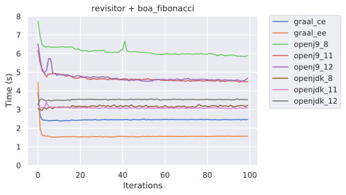](vm-perfs-figures/no_warmuprevisitor + boa_fibonacci_r.png)
[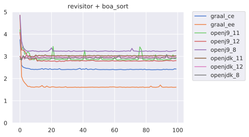](vm-perfs-figures/no_warmuprevisitor + boa_sort_r.png)
[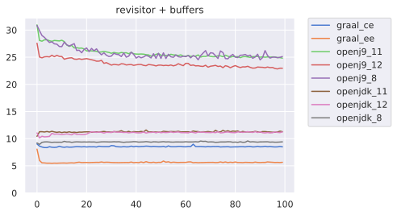](vm-perfs-figures/no_warmuprevisitor + buffers_r.png)
[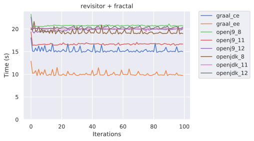](vm-perfs-figures/no_warmuprevisitor + fractal_r.png)
[](vm-perfs-figures/no_warmupswitch + boa_fibonacci_r.png)
[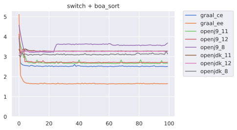](vm-perfs-figures/no_warmupswitch + boa_sort_r.png)
[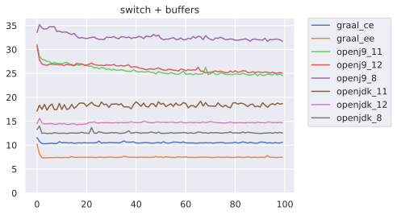](vm-perfs-figures/no_warmupswitch + buffers_r.png)
[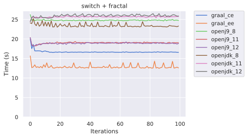](vm-perfs-figures/no_warmupswitch + fractal_r.png)
[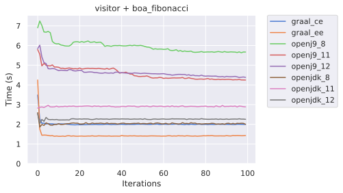](vm-perfs-figures/no_warmupvisitor + boa_fibonacci_r.png)
[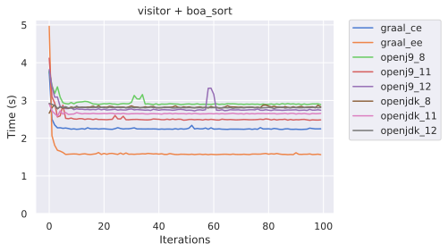](vm-perfs-figures/no_warmupvisitor + boa_sort_r.png)
[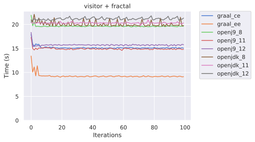](vm-perfs-figures/no_warmupvisitor + fractal_r.png)
-->

The graph below present the performance of four programs (boa_fibonacci, boa_sort, buffers, and fractal), on the 8 studied virtual machines, running on languages implemented using the four implementation patterns.

[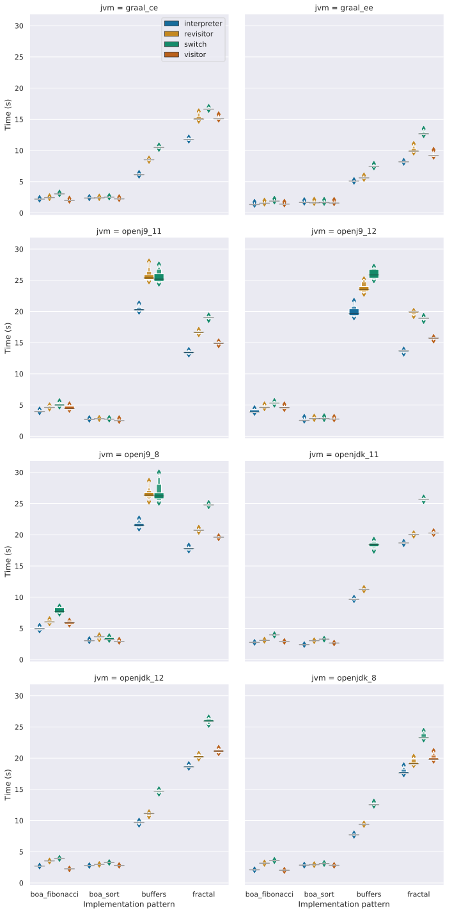](vm-perfs-figures/impl_patterns.svg)

We can observe a global ordering of the performance of the patterns as follow:  
`interpreter > visitor >revisitor > switch`, where visitor and revisitor are often close to equal.

OpenJ9, all version confounded, presents the largest deviation of the execution times, and only in the case of the buffer program.
Similarly, the fractal program leads to a small deviation of the execution times, on OpenJDK 8 and the Graal VMs.

## Conclusion

Those measurements highlight the performance-related properties of JVM and implementation pattern in the specific case of External DSLs executing long-running programs (most of the programs have average execution time ranging from 5 to 15 seconds).
They cannot be generalized to a broader context.
Still, we hope to see them are as a help in the choice of JVM and Implementation pattern for language engineers.

[^minijava]: **MiniJava:** [http://www.cs.tufts.edu/~sguyer/classes/comp181-2006/minijava.html](http://www.cs.tufts.edu/~sguyer/classes/comp181-2006/minijava.html)
[^boa]: **Boa:** [http://plzoo.andrej.com/language/boa.html](http://plzoo.andrej.com/language/boa.html)
[^fsm]: **FSM:** [https://github.com/gemoc/MODELS2017Tutorial/](https://github.com/gemoc/MODELS2017Tutorial/)
[^logo]: **Logo:** [https://turtleacademy.com/](https://turtleacademy.com/)